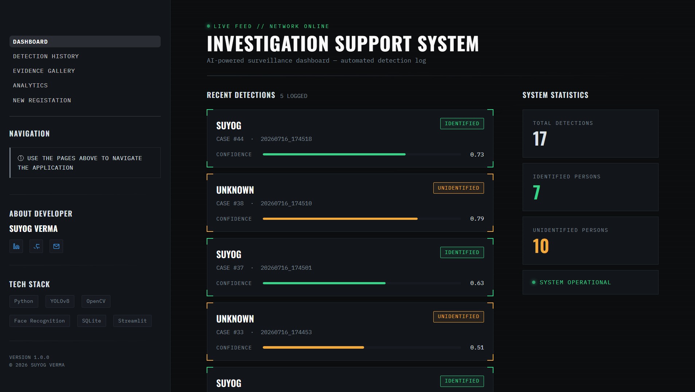
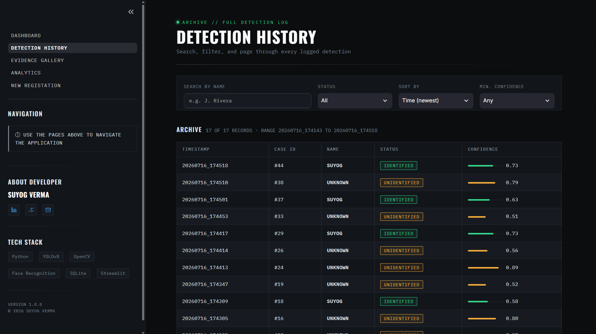
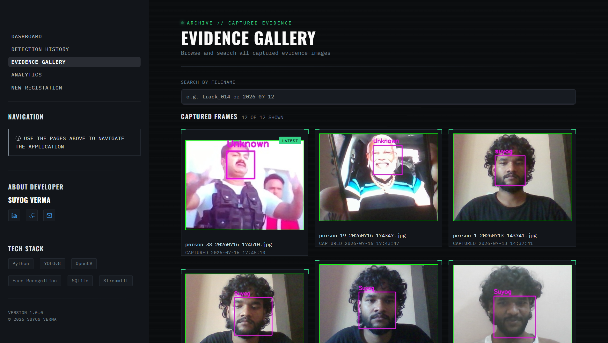
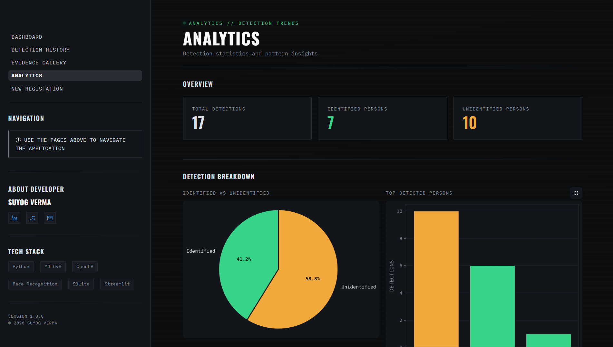
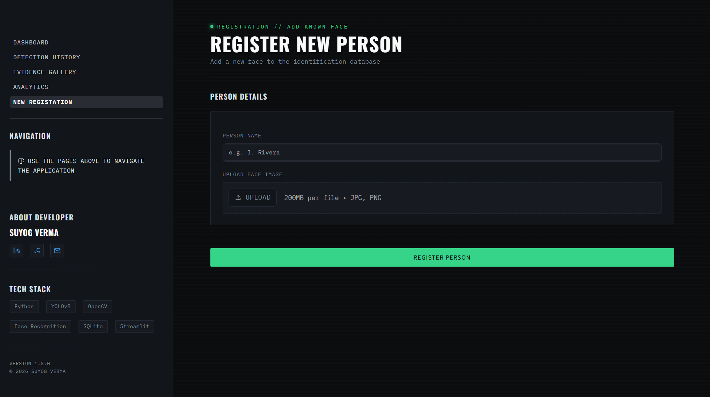

# Investigation Support System

AI-powered surveillance pipeline — YOLOv8 detection, face recognition, and object tracking feeding a Streamlit dashboard for reviewing what the system has seen.


---

## What this is

A camera feed runs through YOLOv8 for person detection, using Ultralytics' built-in tracking to keep IDs consistent across frames, and `face_recognition` for identifying anyone in the known-faces database. Every detection gets logged to SQLite with a track ID, confidence score, and timestamp, and a snapshot is saved as evidence. The dashboard is where you actually look at that data — recent activity, full history, the evidence images themselves, and some basic analytics.

It's built as two separate pieces that share one database:

- **Detection engine** (`app.py`) — runs the camera loop, does the detection/tracking/recognition, writes to `detections.db`, saves images to `detections/`.
- **Dashboard** (`dashboard.py` + `pages/`) — a Streamlit app that reads from the same database. Doesn't touch the camera at all, so you can review past detections without the engine running.

They're decoupled on purpose: you can leave the detection engine running headless somewhere and check the dashboard from a completely different session.

---

## How it works

```
Camera feed
    │
    ▼
YOLOv8 — person detection
    │
    ▼
Ultralytics tracking — assigns/tracks IDs across frames
    │
    ▼
face_recognition — matches against known_faces/
    │
    ├──▶ SQLite (detections.db)   → track ID, name, confidence, timestamp
    └──▶ detections/              → evidence snapshot
```

The dashboard just queries `detections.db` and reads from `detections/` — no live connection to the camera or detection loop.

---

## Dashboard pages

| Page | What it does |
|---|---|
| **Dashboard** | Snapshot view — total/known/unknown counts, 5 most recent detections |
| **Detection History** | Full searchable log — filter by name, status, confidence, date; paginated table |
| **Evidence Gallery** | Grid of captured snapshots, sortable by capture time, searchable by filename |
| **Analytics** | Known vs. unknown breakdown, top detected people, detections-over-time trend |
| **Register Person** | Upload a face + name to add someone to `known_faces/` (engine restart required to pick it up) |

### Screenshots

**Dashboard**


**Detection History**


**Evidence Gallery**


**Analytics**


**Register Person**


---

## Tech stack

| Category | Tools |
|---|---|
| Detection | YOLOv8 (Ultralytics), OpenCV |
| Tracking | Ultralytics built-in tracking |
| Recognition | face_recognition, dlib |
| GPU acceleration | PyTorch (torch, torchvision) |
| Storage | SQLite |
| Dashboard | Streamlit |
| Analysis | Matplotlib |
| Images | Pillow |

---

## Project structure

```
Investigation-Support-System/
├── app.py                     # detection engine (camera loop)
├── dashboard.py                # Streamlit entry point
├── requirements.txt             # base deps (CPU)
├── requirements-gpu.txt         # torch + torchvision for CUDA
├── detections.db
│
├── known_faces/                # registered face images
├── detections/                 # captured evidence snapshots
├── models/                     # YOLOv8 weights
├── assets/                     # README screenshots
│
├── pages/
│   ├── Detection_History.py
│   ├── Evidence_Gallery.py
│   ├── Analytics.py
│   └── Register_Person.py
│
└── ui/
    ├── style.py                 # shared design system (colors, type, components)
    └── sidebar.py                # shared sidebar, imported by every page
```

---

## Setup

```bash
git clone https://github.com/commit-msuyog/Investigation-Support-System.git
cd Investigation-Support-System

python -m venv venv
source venv/bin/activate      # venv\Scripts\activate on Windows

pip install -r requirements.txt
```

`torch` and `torchvision` are kept in a separate `requirements-gpu.txt` since the right build depends on your CUDA version. Get the install command for your setup from [pytorch.org](https://pytorch.org/get-started/locally/), then run it (or install `requirements-gpu.txt` if it's already pinned to your CUDA version). CPU-only works too — YOLOv8 will just run slower.

Drop a YOLOv8 weights file into `models/` (e.g. `models/yolov8n.pt`).

Run the detection engine and the dashboard separately — they don't depend on running in the same process:

```bash
python app.py                 # starts the camera/detection loop
streamlit run dashboard.py    # starts the dashboard (separate terminal)
```

---

## Why it's built this way

A few decisions worth explaining rather than leaving implicit:

- **Detection and dashboard are separate processes.** The camera loop shouldn't be blocked by someone browsing the evidence gallery, and vice versa. SQLite is the handoff point.
- **Registering a person doesn't hot-reload the engine.** Face encodings get loaded once at startup for speed; adding someone new means restarting the engine. Not ideal, on the roadmap.
- **Evidence images are just files on disk, not blobs in the DB.** Keeps the database small and lets the gallery page work directly off the filesystem.

---

## Where this came from

The detection pipeline, tracking integration, database schema, and dashboard logic are mine. I used Claude to iterate on the Streamlit UI — going from default Streamlit components to the current styled version (custom CSS design system, restyled charts, consistent layout across pages). The AI pipeline, data model, and application logic weren't AI-generated; the frontend polish was AI-assisted.

---

## What's next

Realistic near-term stuff, not a roadmap for a startup:

- Reload known faces without restarting the detection engine
- Export detection history to CSV/PDF
- Basic email/webhook alert when an unknown person is detected repeatedly
- Multi-camera support (currently single feed)

Further out, if this grows past a personal project: live streaming to the dashboard instead of polling the DB, and maybe a lightweight auth layer if it ever runs somewhere multi-user.

---

## Contributing

Open to PRs and issues if you find bugs or want to extend it. Fork, branch, PR — nothing fancier than that.

## License

MIT — see [LICENSE](LICENSE) for details.

---

## About

**Suyog Verma** — Machine Learning Engineer, mostly working in computer vision and applied ML.

- LinkedIn: [linkedin.com/in/suyog01](https://www.linkedin.com/in/suyog01/)
- GitHub: [github.com/commit-msuyog](https://github.com/commit-msuyog)
- Email: suyogverma0057@gmail.com

---

## Acknowledgements

Built on top of Ultralytics YOLOv8, OpenCV, `face_recognition`, Streamlit, SQLite, Pandas, and Matplotlib. All open source, all doing the heavy lifting.

---

<div align="center">

**Investigation Support System** — © 2026 Suyog Verma

</div>